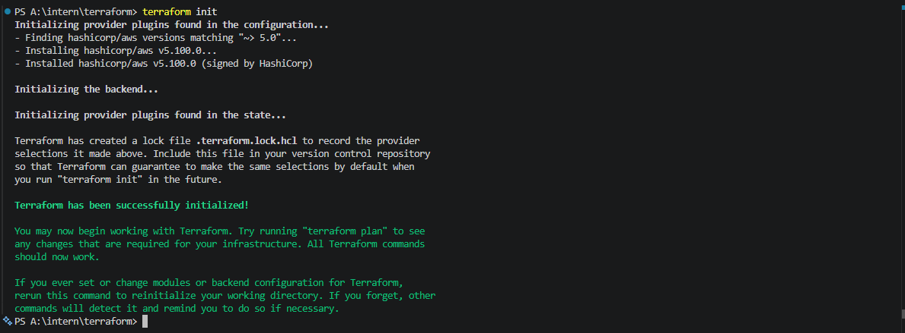
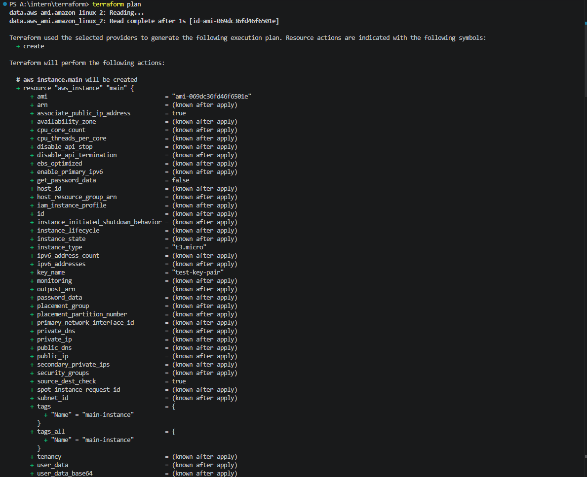
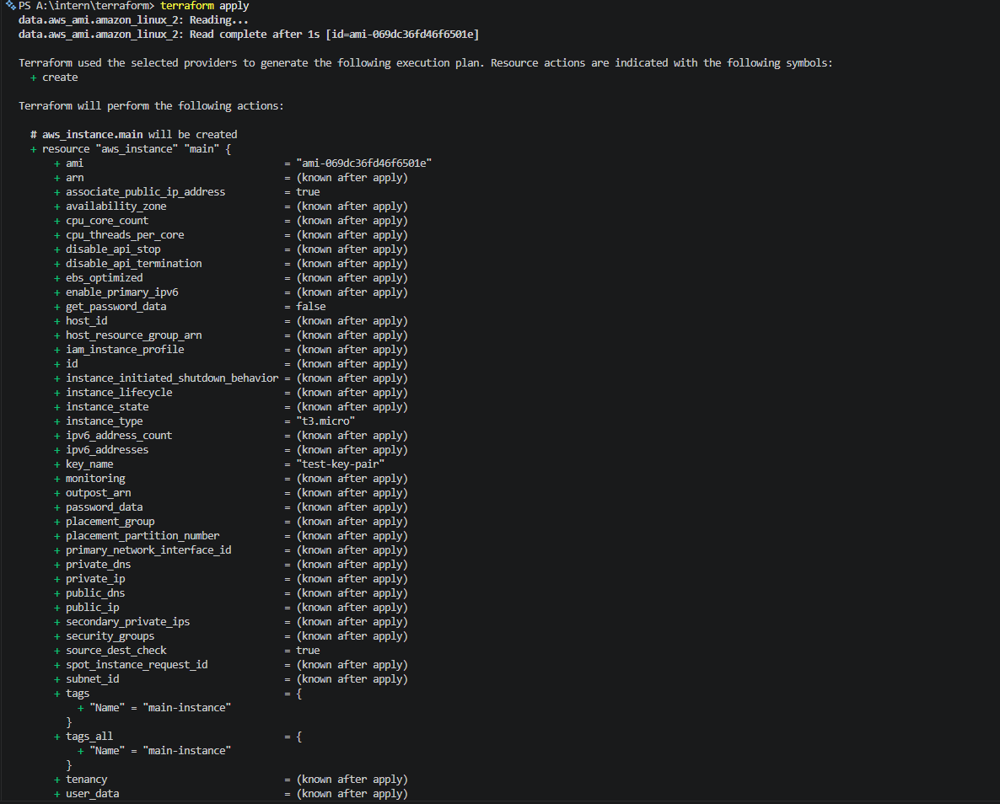
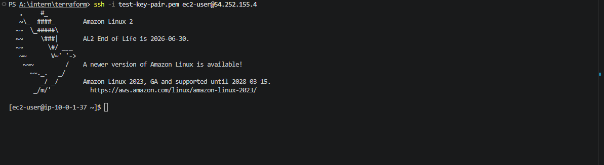

# Terraform AWS Infrastructure Project

**Intern ID:** CITS706  
**Intern Name:** Mohammad Arif  
**Duration:** 1 Week  
**Project Name:** Infrastructure as Code (Terrafrom)  
**Project Scope:** Dockerized Web Application  

## What is Terraform?

Terraform is an open-source Infrastructure as Code (IaC) tool developed by HashiCorp. It allows you to safely and predictably create, change, and improve infrastructure resources by defining them in configuration files. Think of Terraform as the automation engine for your cloud infrastructure - instead of manually clicking through cloud provider consoles, you write code to describe your entire infrastructure.

## Why Use Terraform?

Terraform has become the industry standard for infrastructure provisioning because it provides:

| Benefit | Description |
|---------|-------------|
| **Infrastructure as Code** | Define infrastructure in human-readable configuration files that can be version-controlled, reviewed, and tested like any other code |
| **Multi-Cloud Support** | Supports AWS, Azure, Google Cloud, and hundreds of other providers through providers |
| **Declarative Syntax** | You describe the desired state, and Terraform figures out how to achieve it |
| **Resource Graph** | Automatically parallelizes infrastructure creation by understanding resource dependencies |
| **State Management** | Tracks resource lifecycles and relationships, enabling safe updates and deletions |
| **Change Automation** | Plans changes before applying them, showing exactly what will be created, modified, or destroyed |

## Basic Architecture Concepts

Before diving into this project's infrastructure, here are the fundamental AWS networking concepts used:

### VPC (Virtual Private Cloud)
An isolated section of the AWS cloud where you can launch resources in a virtual network that you fully control. You define its IP address range, subnets, and routing rules.

### Subnet
A segment of a VPC's IP address range where you place groups of resources. Subnets can be:
- **Public**: Has a route to the Internet Gateway, resources can access and be accessed from the internet
- **Private**: No internet route, resources are isolated from direct internet access

### Internet Gateway
A horizontally scaled, redundant, and highly available AWS component that allows communication between your VPC and the internet.

### Security Group
A virtual firewall that controls inbound and outbound traffic to your instances. Think of it as a firewall rulebook for your EC2 instances.

### EC2 (Elastic Compute Cloud)
Virtual machines in AWS where you can run your applications and services.

### S3 (Simple Storage Service)
Object storage service designed for storing and retrieving any amount of data from anywhere on the web.

## Project Description

This project provisions a production-style AWS infrastructure using Terraform as Infrastructure as Code (IaC). It automates the creation of networking, security, compute, and storage resources on AWS. The infrastructure is designed to be reusable, version-controlled, and easily maintainable.

## Architecture Overview

```
                              Internet
                                  │
                                  ▼
                ┌─────────────────────────────────────┐
                │         AWS Internet Gateway        │
                └─────────────────────────────────────┘
                               │
                               ▼
    ┌─────────────────────────────────────────────────────────────┐
    │                    VPC (10.0.0.0/16)                        │
    │  ┌───────────────────────────────────────────────────────┐  │
    │  │             Public Subnet (10.0.1.0/24)               │  │
    │  │         Availability Zone: ap-southeast-2a            │  │
    │  │                                                       │  │
    │  │  ┌───────────────────────────────────────────────┐    │  │
    │  │  │      EC2 Instance                             │    │  │
    │  │  │      ┌────────────────────────────────────┐   │    │  │
    │  │  │      │ Public IP: Ephemeral               │   │    │  │
    │  │  │      │ Private IP: From subnet range      │   │    │  │
    │  │  │      │ OS: Amazon Linux 2                 │   │    │  │
    │  │  │      │ Security Group: main-sg            │   │    │  │
    │  │  │      └────────────────────────────────────┘   │    │  │
    │  │  │                  │    │    │                  │    │  │
    │  │  │             SSH:22  HTTP:80  HTTPS:443        │    │  │
    │  │  └───────────────────────────────────────────────┘    │  │
    │  │                                                       │  │
    │  │  S3 Bucket: Configurable via bucket_name variable     │  │
    │  │  - Globally unique bucket name                        │  │
    │  │  - Permanent storage (survives instance restarts)     │  │
    │  └───────────────────────────────────────────────────────┘  │
    └─────────────────────────────────────────────────────────────┘
```

## What Infrastructure Will Be Created?

When you run `terraform apply` in your AWS account, the following resources will be provisioned:

### Networking Resources
| Resource | Description | Key Details |
|----------|-------------|-------------|
| **VPC** | Virtual Private Cloud | CIDR: 10.0.0.0/16, DNS enabled |
| **Public Subnet** | Subnet for public-facing resources | CIDR: 10.0.1.0/24, AZ: ap-southeast-2a |
| **Internet Gateway** | Enables internet connectivity | Attached to VPC |
| **Route Table** | Controls network traffic routing | 0.0.0.0/0 → Internet Gateway |

### Security Resources
| Resource | Description | Access |
|----------|-------------|--------|
| **Security Group** | Virtual firewall for EC2 | Inbound: 22, 80, 443 TCP from 0.0.0.0/0 |
|  |  | Outbound: All traffic to 0.0.0.0/0 |

### Compute Resources
| Resource | Description | Details |
|----------|-------------|---------|
| **EC2 Instance** | Virtual machine for applications | Amazon Linux 2, t3.micro (configurable) |
|  |  | Public IP assigned, in public subnet |
|  |  | SSH access via key pair (optional) |

**The instance is application-ready and can be used to host:**
- Web applications (web servers, static sites)
- APIs (REST, GraphQL endpoints)
- Development environments (IDE servers, testing environments)
- Background services (workers, cron jobs, microservices)

### Storage Resources
| Resource | Description | Details |
|----------|-------------|---------|
| **S3 Bucket** | Object storage | Globally unique bucket name, configurable via `bucket_name` variable |

### Output Values
After deployment, you'll receive:
- `instance_public_ip` - Public IP to SSH into your instance
- `instance_id` - Unique AWS identifier for the EC2 instance
- `instance_private_ip` - Private IP for internal communication
- `bucket_name` - Full S3 bucket name for storage access
- `for_fun` - A fun confirmation message (just for fun!)

## Typical Workflow

Follow these steps to get started with this infrastructure:

```bash
# 1. Clone the repository
git clone <repository-url>
cd terraform

# 2. Configure AWS credentials
aws configure

# 3. Initialize Terraform
terraform init

# 4. Review the execution plan
terraform plan

# 5. Apply the infrastructure
terraform apply
```

After deployment:
- Access your EC2 instance via SSH: `ssh -i ~/.ssh/your-key.pem ec2-user@<public-ip>`
- Deploy your application to the instance
- Access web applications via: `http://<public-ip>`

When done:
```bash
# Clean up all resources
terraform destroy
```

## Architecture Summary

**Traffic Flow:**
1. User connects to the EC2 instance's Public IP
2. Traffic reaches the Internet Gateway (gateway to internet)
3. Route Table directs traffic to the Public Subnet
4. EC2 Instance receives traffic on ports 22 (SSH), 80 (HTTP), 443 (HTTPS)
5. S3 Bucket provides durable object storage accessible via AWS API

**Use Cases:**
- Web hosting (EC2 runs a web server)
- Development/staging environment
- File storage and backup
- Learning AWS networking concepts

## Prerequisites

- Terraform v1.0 or higher
- AWS Account with appropriate permissions
- AWS CLI configured with access keys (`aws configure`)
- SSH key pair (optional, for EC2 access)

## File Structure

```
A:\intern\terraform\
├── main.tf           # Main resource definitions (VPC, Subnet, EC2, S3)
├── variables.tf      # Input variable declarations
├── outputs.tf        # Output value declarations (EC2 IP, Instance ID, Bucket Name)
├── providers.tf      # Provider configuration (AWS, Terraform version)
├── terraform.tfvars  # Variable values (optional, for overrides)
├── .gitignore        # Git ignore rules (terraform state files)
└── README.md         # This documentation file
```

## Variables

| Variable | Description | Default |
|----------|-------------|---------|
| `region` | AWS region for resource provisioning | `ap-southeast-2` |
| `instance_type` | EC2 instance type | `t3.micro` |
| `instance_name` | Name tag for EC2 instance | `main-instance` |
| `key_pair_name` | SSH key pair name (empty = no key) | `""` |
| `bucket_name` | S3 bucket name (must be unique) | `main-terraform-bucket` |

## Terraform Commands

| Command | Description |
|---------|-------------|
| `terraform fmt` | Formats configuration files to standard style |
| `terraform validate` | Validates configuration syntax and semantics |
| `terraform init` | Initializes working directory, downloads providers |
| `terraform plan` | Shows execution plan (what will be created/changed) |
| `terraform apply` | Creates or updates infrastructure |
| `terraform apply -auto-approve` | Applies without manual confirmation |
| `terraform output` | Displays output values from state |
| `terraform output -json` | Displays outputs in JSON format |
| `terraform destroy` | Destroys all infrastructure |

## Apply Instructions

1. **Initialize the project**:
   ```bash
   terraform init
   ```

2. **Validate configuration**:
   ```bash
   terraform validate
   ```

3. **Preview changes**:
   ```bash
   terraform plan
   ```

4. **Apply infrastructure**:
   ```bash
   terraform apply
   ```
   - Review the execution plan
   - Type `yes` to confirm

5. **Verify outputs**:
   ```bash
   terraform output
   terraform output instance_public_ip
   terraform output bucket_name
   ```

## Destroy Instructions

To remove all created resources:

```bash
terraform destroy
```

Type `yes` to confirm. This will:
- Terminate EC2 instance
- Delete S3 bucket
- Remove security group
- Delete route table
- Detach internet gateway
- Delete subnet
- Delete VPC

## Rollback Strategy

### Output Issues
If outputs are incorrect or need modification:
1. Edit `outputs.tf`
2. Run `terraform apply` to refresh state
3. Outputs can be removed or corrected without destroying resources

### Configuration Issues
If resources fail to create or misconfigure:
1. Review `terraform plan` output
2. Make corrections to source files
3. Run `terraform apply` to reconcile state

### Full Rollback
```bash
terraform destroy
```

This ensures a clean slate for re-application.

## Validation

After applying, verify:

| Resource | Verification Method |
|----------|----------------------|
| VPC | AWS Console → VPC → Check for "main-vpc" |
| Public Subnet | AWS Console → VPC → Subnets → Check for "public-subnet" |
| Internet Gateway | AWS Console → VPC → Internet Gateways |
| Route Table | AWS Console → VPC → Route Tables |
| Security Group | AWS Console → EC2 → Security Groups → "main-sg" |
| EC2 Instance | AWS Console → EC2 → Instances → Running status |
| S3 Bucket | AWS Console → S3 → Check bucket list |
| Outputs | `terraform output` command |

## State Management

Terraform maintains state in:
- `terraform.tfstate` - Current state file
- `terraform.tfstate.backup` - Automatic backups

**Important**: Add these to `.gitignore`:
```
.terraform/
*.tfstate
*.tfstate.*
terraform.tfvars
```

**Note**: `.terraform.lock.hcl` should be committed to version control. This file ensures provider version consistency across all environments and team members.

## Best Practices Applied

- **Version Control**: Terraform version pinned (`>= 1.0`)
- **Provider Versioning**: AWS provider locked (`~> 5.0`)
- **Resource Tagging**: All resources tagged with Name
- **DRY Configuration**: Data sources used for AMI lookup
- **Security**: Default deny egress, specific ingress rules
- **Modularity**: Clear separation between resources

## Troubleshooting

| Issue | Solution |
|-------|----------|
| Provider not found | Run `terraform init -upgrade` |
| State lock | Wait for lock or run `terraform force-unlock [LOCK_ID]` |
| Permission denied | Verify AWS credentials with `aws sts get-caller-identity` |
| AMI not found | Check region supports Amazon Linux 2 |

## Support

For infrastructure changes:
1. Modify Terraform files
2. Run `terraform plan` to preview changes
3. Run `terraform apply` to implement
4. Update README if architecture changes significantly

---

## Screenshots
| Init | Plan |
|-------|-----------|
|  |  |

| Apply | Connect |
|-------|-----------|
|  |  |
 